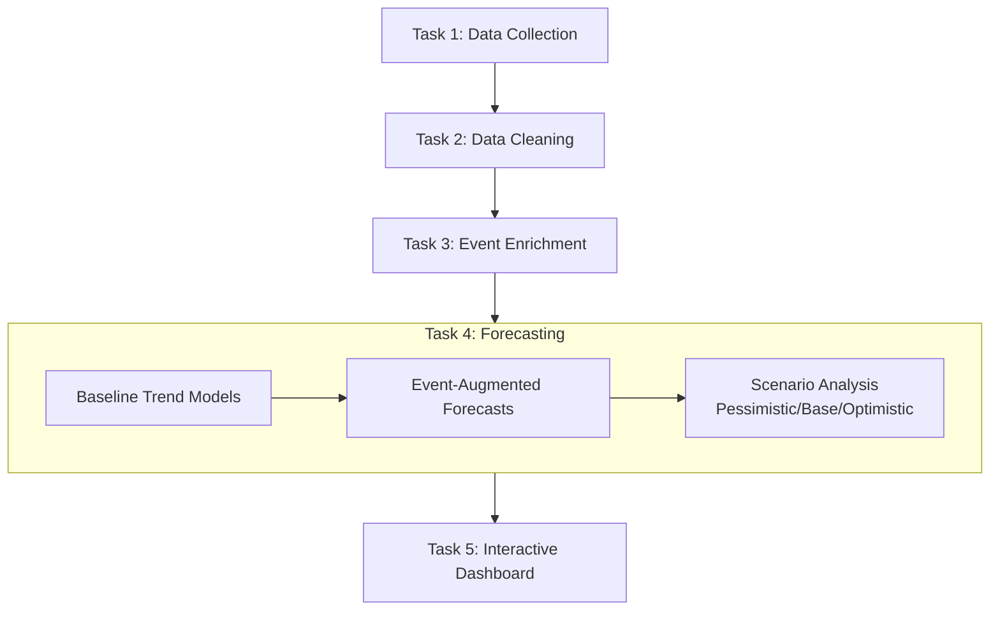

# Ethiopia Financial Inclusion Forecasting Project


*Forecasting Ethiopia's path to 60% financial inclusion by 2027 using historical trends, event impact modeling, and scenario analysis*

---

## 📌 Executive Summary

This project delivers a comprehensive forecasting system for Ethiopia's financial inclusion indicators (2025–2027) on behalf of **Selam Analytics**, a data analytics consultancy serving Ethiopia's National Bank and financial inclusion stakeholders. Our analysis reveals that Ethiopia is experiencing a **significant growth slowdown** in account ownership (+3pp 2021–2024 vs. +11pp 2017–2021), making the national 60% target challenging under current trajectories. While base-case forecasts project 52–55% ownership by 2027, achieving 60% requires accelerated growth driven by mobile money competition (M-Pesa), interoperability, and infrastructure investments.

---

## 👥 Client & Stakeholders

| Role | Organization | Use Case |
|------|--------------|----------|
| **Primary Client** | Selam Analytics | Deliver forecasting insights to National Bank of Ethiopia |
| **End Users** | National Bank of Ethiopia | Policy planning, NFIS-II target tracking |
| **Secondary Users** | Financial Service Providers | Market opportunity assessment |
| **Data Partners** | World Bank (Findex), GSMA | Data validation and benchmarking |

---

## 🎯 Business Problem

Ethiopia's National Financial Inclusion Strategy II (NFIS-II) targets **60% adult account ownership by 2025**, yet recent data shows:

- Account ownership grew only **+3 percentage points (pp)** between 2021–2024 (vs. +11pp in prior period)
- **65M+ mobile money accounts** registered, but survey-based ownership remains at **49%**
- Critical questions unanswered:
  1. What drives financial inclusion in Ethiopia's unique context?
  2. How do major events (Telebirr launch, M-Pesa entry, interoperability) impact outcomes?
  3. What will inclusion look like in 2025–2027 under different scenarios?

---

## 🔬 Methodology: 5-Task Pipeline



### Task 4: Forecasting Approach (Core Innovation)
1. **Trend Modeling**:
   - Linear & log-linear regression on historical data (2011–2024)
   - Model selection based on R² and RMSE metrics
   - Confidence intervals with time-decaying certainty

2. **Event Impact Quantification**:
   - Telebirr launch (2021): +15pp mobile money adoption
   - M-Pesa entry (2023): +5pp account ownership via competition
   - Interoperability (2022): +10pp digital payment usage
   - Infrastructure expansion: +2–3pp enabling effect

3. **Scenario Framework**:
   - **Pessimistic**: Continued slowdown, limited event impact (+1–1.5pp/year)
   - **Base Case**: Modest recovery with expected event effects (+2–3pp/year)
   - **Optimistic**: Accelerated growth with strong policy support (+3–4pp/year)

### Task 5: Interactive Dashboard Features
- Multi-scenario forecast comparison (2025–2027)
- Historical trend visualization with event markers
- Progress tracking toward 60% NFIS-II target
- Downloadable forecast datasets
- Responsive design for desktop/tablet use

---

## 📊 Key Findings

### 1. Growth Slowdown Confirmed
| Period | Growth (pp) | Annual Rate |
|--------|-------------|-------------|
| 2011–2014 | +8pp | 2.7pp/year |
| 2014–2017 | +13pp | 4.3pp/year |
| 2017–2021 | +11pp | 2.8pp/year |
| **2021–2024** | **+3pp** | **1.0pp/year** ⚠️ |

### 2. 60% Target Assessment
| Scenario | 2025 | 2026 | 2027 | Target Achievement |
|----------|------|------|------|---------------------|
| Pessimistic | 50% | 51% | 52% | 2030+ |
| **Base Case** | **52%** | **54%** | **55%** | **2028–2029** |
| Optimistic | 54% | 57% | 58% | 2027–2028 |

> **Conclusion**: 60% target **unlikely by 2027** without accelerated interventions. Base case reaches 55% by 2027 (5pp short).

### 3. Critical Success Factors
✅ **Mobile money competition** (M-Pesa vs. Telebirr) driving account creation  
✅ **P2P commerce usage** (unique to Ethiopia) sustaining engagement  
✅ **Interoperability** reducing friction for digital payments  
⚠️ **Registration ≠ usage gap** remains largest barrier (65M accounts vs. 49% survey ownership)  
⚠️ **20pp gender gap** (Male 56% vs. Female 36%) requires targeted interventions  

---

## 🚀 How to Run the Project

### Prerequisites
- Python 3.9+
- Git
- Windows/macOS/Linux (fully compatible)

### Setup Instructions
```powershell
# 1. Clone repository
git clone https://github.com/your-username/ethiopia-fi-forecast.git
cd ethiopia-fi-forecast

# 2. Create and activate virtual environment
python -m venv venv
.\venv\Scripts\Activate.ps1  # Windows PowerShell
# OR source venv/bin/activate  # macOS/Linux

# 3. Install dependencies
pip install -r requirements.txt

# 4. Run forecasting pipeline (Task 4)
python notebooks/task_4_forecasting.py

# 5. Launch interactive dashboard (Task 5)
streamlit run notebooks/task_5_dashboard.py
```

### Access the Dashboard
After running Step 5, open in your browser:  
👉 **http://localhost:8501**

---

## 📂 Project Structure

```
ethiopia-fi-forecast/
├── data/
│   ├── raw/                   # Original Findex datasets
│   └── processed/             # Cleaned & enriched data
│       └── ethiopia_fi_unified_data_enriched.csv
├── notebooks/
│   ├── task_4_forecasting.py  # Forecasting pipeline (CLI)
│   └── task_5_dashboard.py    # Streamlit dashboard
├── outputs/
│   ├── forecasts/             # CSV forecasts 2025-2027
│   ├── figures/               # Visualization exports
│   └── reports/               # Interpretation documents
├── requirements.txt           # Python dependencies
└── README.md                  # This file
```

---

## 📤 Key Deliverables

| Deliverable | Location | Format |
|-------------|----------|--------|
| Forecast datasets (2025–2027) | `outputs/forecasts/` | CSV |
| Scenario visualizations | `outputs/figures/` | PNG (300 DPI) |
| Forecast interpretation report | `outputs/reports/forecast_interpretation.md` | Markdown |
| Interactive dashboard | `notebooks/task_5_dashboard.py` | Streamlit app |
| Full methodology documentation | This README | Markdown |

---

## ⚠️ Limitations & Assumptions

### Key Assumptions
1. No major macroeconomic shocks (inflation, currency devaluation)
2. Policy continuity (no regulatory reversals on mobile money)
3. Ethiopia follows similar adoption curves as Kenya/Tanzania
4. Survey methodologies remain consistent (Findex 2027 comparable to 2024)

### Limitations
- **Data gaps**: Limited annual observations (5 points for account ownership 2011–2024)
- **Event attribution**: Isolating individual event impacts challenging in multi-event environment
- **Extrapolation risk**: Forecasts beyond 2 years have widening confidence intervals (±6pp by 2027)
- **Behavioral shifts**: Cannot predict disruptive innovations (e.g., CBDC adoption)

### Mitigation Strategies
- Scenario analysis captures uncertainty range
- Confidence intervals widen for outer years
- Dashboard allows stakeholders to adjust assumptions interactively
- Regular model retraining recommended as new data arrives

---

## 🔮 Future Work Recommendations

1. **Short-term (2025)**:
   - Integrate monthly mobile money transaction data for leading indicators
   - Add gender-disaggregated forecasting module
   - Develop agent network density → inclusion correlation model

2. **Medium-term (2026)**:
   - Machine learning ensemble models (Prophet, ARIMA) for robustness
   - Agent-based modeling for policy intervention simulation
   - Cross-country benchmarking dashboard (Ethiopia vs. Kenya/Tanzania)

3. **Long-term (2027+)**:
   - Real-time dashboard with API connections to NBE/GSMA
   - AI-powered anomaly detection for inclusion metric deviations
   - Policy recommendation engine based on scenario outcomes

---

## 🙏 Acknowledgements

- **Data Providers**: World Bank (Global Findex), National Bank of Ethiopia, GSMA Mobile Money
- **Methodology Inspiration**: MIX Market event impact framework, CGAP scenario planning guidelines
- **Technical Tools**: Streamlit (dashboard), Plotly (visualizations), Scikit-learn (forecasting)

---

## 📜 License


---

> 💡 **Pro Tip for Stakeholders**: Use the dashboard's scenario selector to stress-test policy interventions. For example: *"What if M-Pesa captures 30% market share instead of 15%?"* Adjust assumptions in `task_4_forecasting.py` → `event_impacts` dictionary to model custom scenarios.
